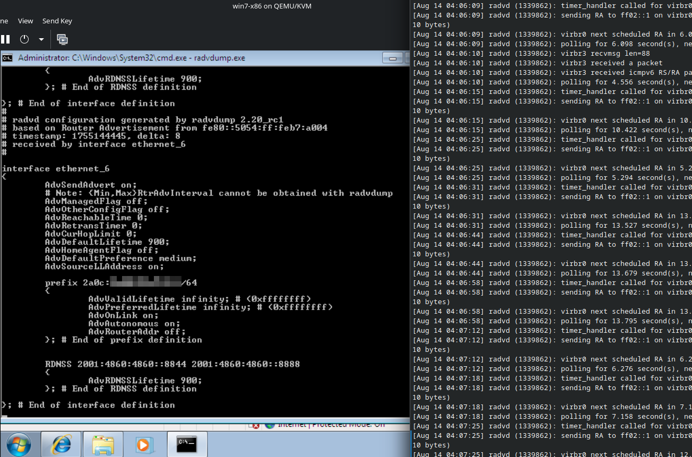
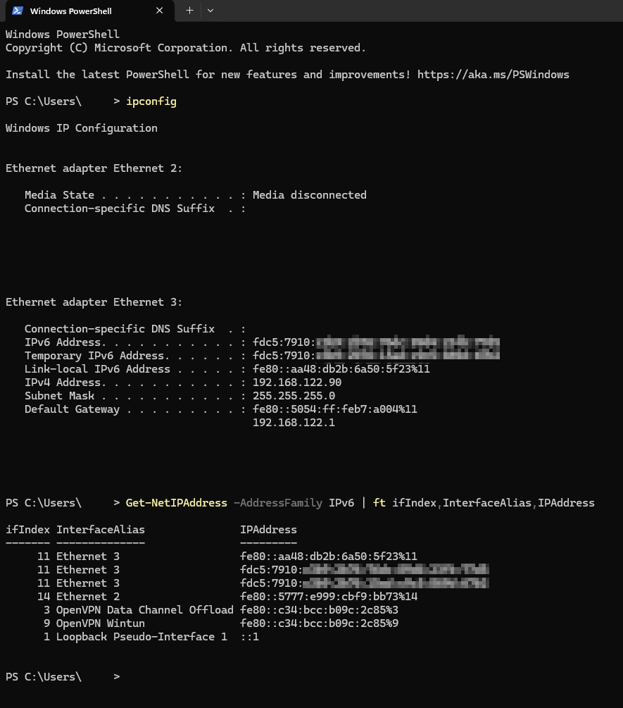

# radvdump for Windows (radvdump.exe)


This is a Windows(mingw) port of
[radvdump](https://github.com/radvd-project/radvd). radvdump.exe is a standalone
lightweight tool for troubleshooting IPv6 router advertisement(RA), without use
of external capture tools like Wireshark.

Minimum OS version: Windows 7

## Download
The prebuilt binaries can be found at https://github.com/dxdxdt/radvd/releases

## COMPILE
Use the separate makefile recipe `Makefile.win32`, which requires the `CC` env
for the mingw C compiler.

```sh
CC=i686-w64-mingw32-gcc   make -f Makefile.win32
CC=x86_64-w64-mingw32-gcc make -f Makefile.win32
```

## Usage
For general usage, see [`man 8 radvdump`](radvdump.8.man).

Run the executable as Administrator, preferably from a shell(cmd.exe or
powershell).

### Specifying Interface
You'll get the following warning when there are multiple active network
interfaces.

```
*** Multiple link-local addresses detected! ***
You may use RADVDUMP_SCOPE_ID env var to specify an interface.
```

Due to restrictions in Windows API, raw sockets can only be bound to one
interface. If there are multiple network interfaces connected to different
LANs(ie. "multi-homed"), you may have to specify the network interface you
desire to listen on.

Windows employs a completely different net interface id scheme. The interface
names shown in the radvdump output are "fake" ones(ie. from IPv6 compatibility
layer[^1]) that are not used elsewhere in Windows. Windows interface names that
are shown in the GUI are actually "aliases", not terse names as in ~nix systems.

Fortunately, like in Unix systems, numeric interface index is used for
zone/scope id(RFC 6874) in Windows. Interface index can be queried in various
ways.

```ps
# older systems
ipconfig

# in newer Powershell
Get-NetIPAddress -AddressFamily IPv6 | ft ifIndex,InterfaceAlias,IPAddress
```



The number after '%' in ipconfig output or the values in `ifIndex` field are the
interface index.

You can pass the interface index with `RADVDUMP_SCOPE_ID` env var when running
the command.

powershell:

```ps
$env:RADVDUMP_SCOPE_ID=12; radvdump.exe
```

[^1]: [notes.md](/doc/mingw/notes.md)
